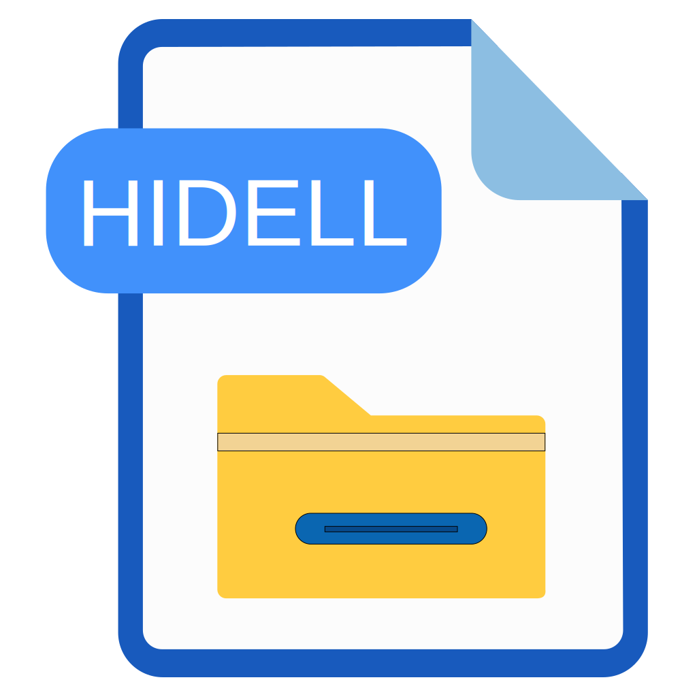

# HIDELL
**hide like linux**

一款可以让Windows系统用户目录变“整洁”的软件，它会自动隐藏“点文件”和“点文件夹”，就像Linux系统下那样。

A software that can make the user directory of the Windows system "tidy". It will automatically hide the "dot files" and "dot folders", just like under the Linux system.
